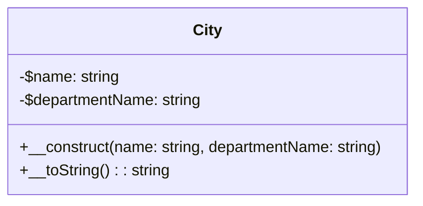
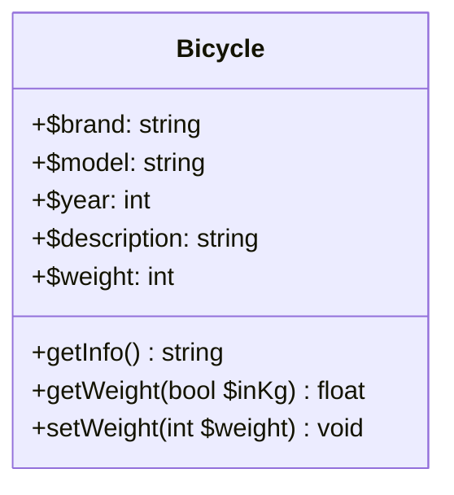
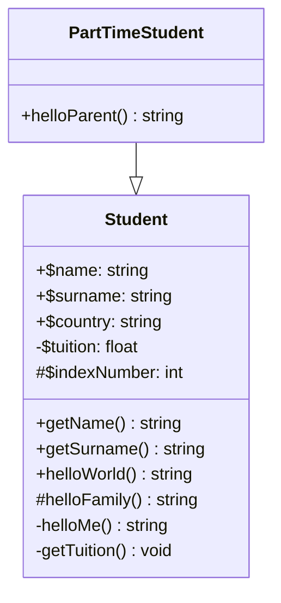
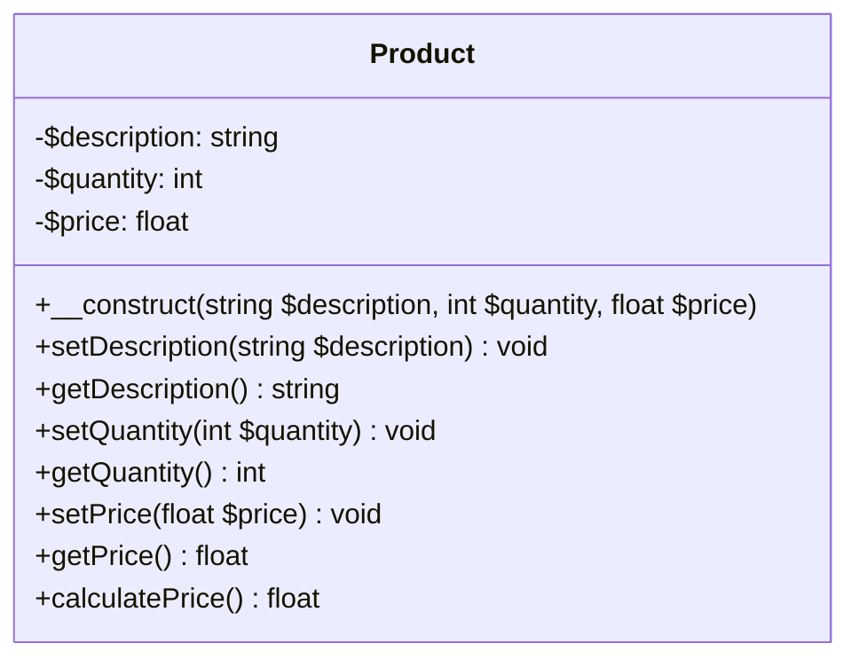
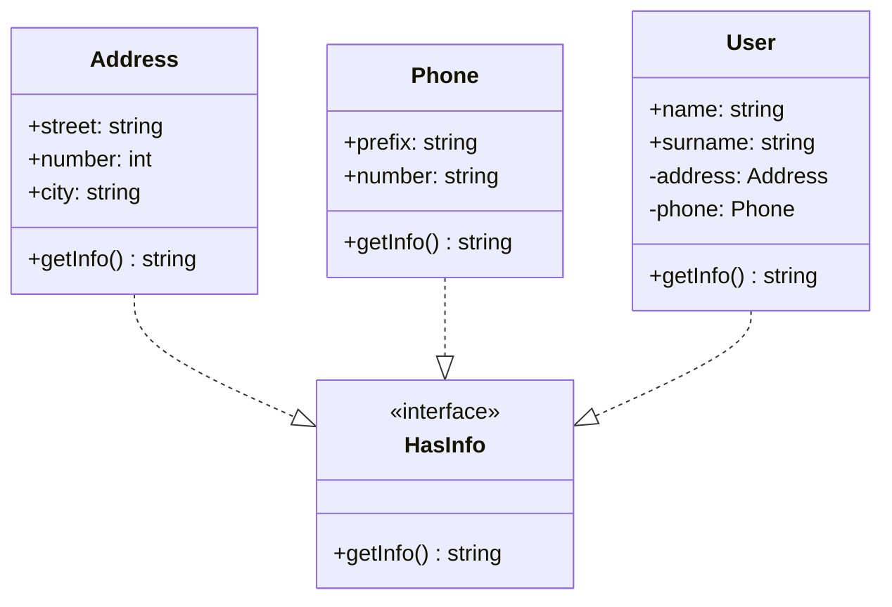
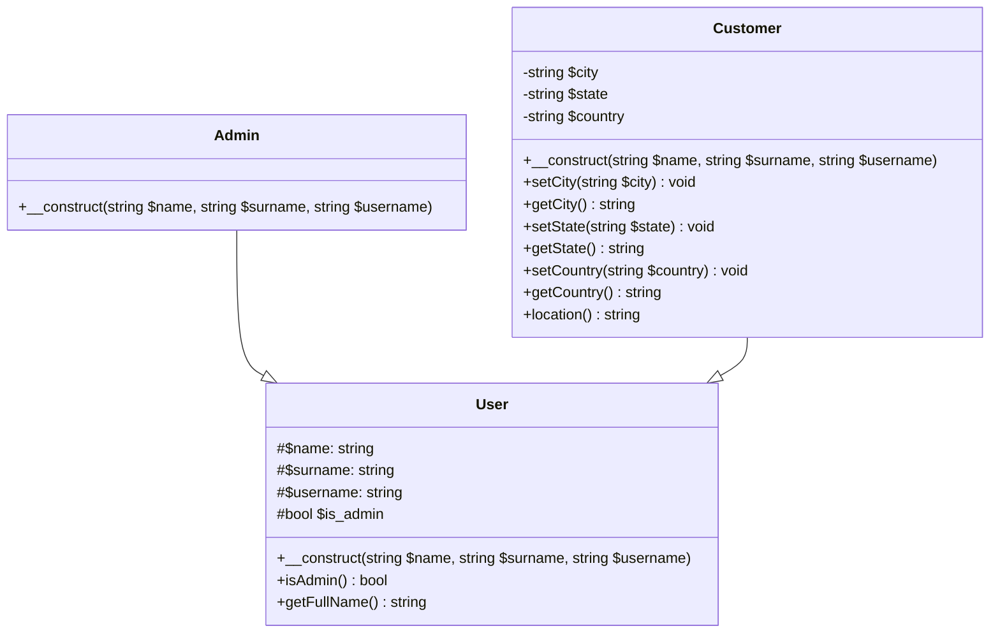
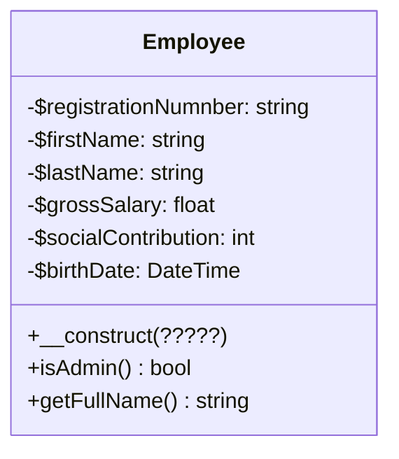

# PHP POO – Exercices

## Utilisation de ce dépôt

Ce dépôt contient un ensemble d'exercices d'initiation à la programmation orientée objet en PHP.

Pour démarrer un serveur de développement PHP pour un dossier spéccifique vous pourrez utiliser la commande suivante :

```sh
php -S localhost:8000 -t .\01-city\ 
```

## 01 - classe "City"

Ecrire une classe "City" dans un fichier "City.class.php" implémentant le diagramme suivant :


La méthode **`__construct(string name, string department)`** est le [constructeur de la classe, il permet l'instanciation des objets de cette classe](https://www.php.net/manual/fr/language.oop5.decon.php). 

La méthode **`__toString()`** doit retourner une chaîne de caractère représentative d'un objet de la classe.

Dans le cas d'un objet de la classe `City` la méthode devra retourner une chaîne de caractère telle que :
`"La ville <nom-ville> est dans le département : <nom-du-département>`

N'oubliez pas que vous pouvez utiliser `$this` au sein d'une méthode pour accéder aux attributs de l'objet manipulé.

### Ajout de getters et setters

Ajoutez les  [`getters` et `setters`](https://www.vincent-vanneste.fr/views/php/co/GetterSetter.html) de la classe `City`.

### Utilisation de la classe

Complétez les `TODOS` du fichier `city/index.php` pour tester votre classe.

### Documentation de la classe

Commentez votre classe en [utilisant la PHPDoc](https://grafikart.fr/tutoriels/phpdoc-1140).

---

## 02 - classe "Bicycle"

Créez une classe appelée **Bicycle**.

La classe doit avoir 5 propriétés publiques :
- `$brand` : la marque du vélo
- `$model` : le modèle du vélo
- `$year` : l'année de production
- `$description` : une description
- `$weight` : le poids du vélo (stocké en grammes par défaut)

La valeur par défaut de la propriété `$description` est "Vélo qui roule".

Créez une méthode **getInfo** (un getter) qui retournera les informations sur le vélo au format suivant :
"`$brand $model ($year)`".

Par exemple, la chaîne de caractères suivante :
```text
Decathlon Rockrider (2020)
```

Créez une méthode **getWeight** qui retournera le poids en grammes.

Rendez cette méthode configurable pour qu’elle accepte un argument, par défaut à `false`.

Si cet argument est `true`, le poids doit être retourné en kilogrammes ; s’il est `false`, le poids doit être retourné en grammes.

Créez une méthode setter pour la propriété `$weight`. La propriété `$weight` stocke le poids en grammes.

Créez deux objets de la classe **Bicycle** et définissez les valeurs pour toutes les propriétés.

Affichez les informations de chaque vélo.

Affichez le poids de chaque vélo en kilogrammes.

Affichez le poids de chaque vélo en grammes.



---

## 03 - classe "Student"

Créez une classe appelée `Student`.

La classe doit avoir :
- 3 propriétés publiques : `$name`, `$surname` et `$country` ;
- 1 propriété privée : `$tuition` ;
- 1 propriété protégée : `$indexNumber`.

Créez des méthodes getter pour le nom et le prénom de l’étudiant.

Créez une méthode publique helloWorld() qui retournera la chaîne « Hello World ».
Créez une méthode protégée helloFamily() qui retournera la chaîne « Hello Family ».
Créez une méthode privée helloMe() qui retournera la chaîne « Hello me! ».
Créez une méthode privée getter getTuition() qui affichera la valeur de la propriété `$tuition`.

Ne pas utiliser de constructeur avec arguments.

Créez une classe fille `PartTimeStudent`.

Ajoutez une méthode publique helloParent() qui appellera la méthode helloFamily() de la classe Student.

Créez des objets des classes Student et `PartTimeStudent`, et appelez toutes les méthodes disponibles.



## 04 - classe "Product"

Créez une classe appelée `Product`.

La classe doit avoir 3 propriétés :
- `$description` : description du produit ;
- `$quantity` : quantité en stock ;
- `$price` : prix unitaire.

Créez une méthode constructeur acceptant 3 arguments (`$description`, `$quantity` et `$price`).

Dans le constructeur, vérifiez que la description est une chaîne de caractères et que la quantité et le prix sont des nombres. Si ce n’est pas le cas, affichez un message d’erreur.

Créez des méthodes setter et getter pour les propriétés `$description`, `$quantity` et `$price`.

Créez une méthode appelée calculatePrice() qui retournera le prix du produit sous la forme : `$quantity * $price`.

Créez un objet de la classe `Product`.

Affichez toutes les propriétés sur des lignes distinctes, puis affichez le résultat de la méthode calculatePrice().



## 05 - utilisation d'interfaces

Créez une interface `HasInfo` qui aura une méthode abstraite appelée `getInfo()`.

Créez une classe appelée `Address` qui implémente l’interface `HasInfo`.

La classe doit avoir 3 propriétés publiques : street, number et city. Définissez-les via le constructeur.

La méthode `getInfo()` dans cette classe peut retourner, par exemple : "Adresse: 13 rue de la Liberté".

Créez une classe appelée Phone qui implémente l’interface `HasInfo`.

La classe doit avoir 2 propriétés publiques : prefix et number. Définissez-les via le constructeur.
La méthode `getInfo()` dans cette classe doit retourner : "Number: `$prefix` / `$number`".

Créez une classe appelée User qui implémente l’interface `HasInfo`.
La classe doit avoir 2 propriétés publiques : `name` et `surname`.
La classe doit avoir 2 propriétés privées : `address` et `phone` (instances des classes ci-dessus).

La méthode `getInfo()` dans cette classe doit appeler les méthodes `getInfo()` des classes `Address` et `Phone` respectivement.

Cette méthode doit renvoyer une chaîne de caractères similaire à cete exemple :
```text
Utilisateur : Ada Lovelace
Adresse : 13 rue de la Liberté
Numéro de téléphone : +44 / 8455231
```

Créez un objet de chaque classe.

Appelez la méthode getInfo de l’objet `User` pour voir le résultat.



## 06 - classe "User" et héritage

Créez 3 classes : `User`, `Admin` et `Customer`.

Classe `User` :
- Doit avoir 3 propriétés protégées : `$name`, `$surname` et `$username` ;
- Définissez leurs valeurs via une méthode constructeur ;
- Ajoutez 1 propriété protégée `$is_admin`. Sa valeur par défaut doit être false ;
- Créez une méthode qui vérifie si l’utilisateur est admin ;
- Créez une méthode qui affiche le nom complet de l’utilisateur. Si l’utilisateur est admin, ajoutez (admin) à la fin.

Classe `Customer` : 
- Doit hériter de la classe `User` :
- Ajoutez 3 propriétés privées : `$city`, `$state`, `$country` ;
- Le constructeur de la classe `Customer` doit avoir les mêmes paramètres que le constructeur parent ;
- Pour les autres propriétés, créez des méthodes setter et getter ;
- Créez une méthode location() qui retourne « `$city`, `$state`, `$country` ».

Classe `Admin` :
- Doit hériter de la classe `User` ;
- Le constructeur doit avoir les mêmes paramètres que le constructeur parent ;
- Le constructeur doit définir la valeur de la propriété `$is_admin` à true.
- Créez des objets de chaque classe. Affichez le nom complet et la valeur de `$is_admin` pour chaque objet, et en plus la localisation (ville, état, pays) pour les objets de la classe `Customer` uniquement



## 07 - classe représentant les salariés d'une entreprise

L'’'objectif est ici de concevoir un page web basée sur une approche objet et permettant de gérer des salariés d’une entreprise.

Fonctionnalités attendues :
- pouvoir afficher les salariés d'une entreprise fictive ;
- pouvoir créer des salariés d’une entreprise ;
- obtenir le salaire net à partir du salaire brut d’un salarié.

### Etape 1 : création de la classe salariée

Dans un premier temps, il vous faudra créer une classe nommée `Employee` représentant un salarié d’une entreprise. Elle devra être contenue dans une fichier nommé `Employee.class.php`.

Un salarié sera défini par les attributs suivants :
- **Matricule** : le matricule du salarié est son identifiant. La valeur du matricule permet donc de discriminer chaque objet de type salarié. Le matricule est une valeur composée de 7 caractères observant les règles suivantes nnXXXnn où n est un chiffre et X un caractère alphabétique (par exemple, le matricule « 11ABC22 » est correct, « Y5BN22 » est incorrect).
- **Nom** : le nom patronymique du salarié.
- **Prénom** : son prénom.
- **Salaire brut** : le salaire de référence, part salariale de charges sociales inclues.
- **Taux de charges sociales** : le taux de charges sociales (part salariale).
- **Date de naissance** : sa date de naissance.

Voici un représentation UML de la classe `Employee` :



Pour la gestion des dates vous pourrez utiliser des objets de la classe `DateTime` ([tutoriel disponible en cliquant ici](https://www.phpfacile.com/apprendre_le_php/dates_avec_classe_datetime)).

### Etape 2 : ajout d'un système de vérification du matricule

La partie précédente présente un format de matricule attendu.

Pour un objet, ce matricule peut être modifié à deux moment :
- à la construction de l'objet (dans le constructeur) ;
- lors de l'appel au `setter` nommé `setMatricule`.

Dans l'une ou l'autre de ces fonctions il **est nécessaire de vérifier si le matricule passé en paramètre est correctement formaté**.

Ceci peut s'effectuer via l'utilisation d'un **expression régulière**.

Dans le cas où le matricule n'est pas correctement formaté vous allez pouvoir utliiser le système d'exception.

Une exception permet d'interrompre une fonction prématurément **lorsqu'un évènement inatendu et susceptible de provoquer des erreurs est rencontré**.

Une exception se lève avec le code suivant (cas d'une exception concernant notre vérification de matricule) :
```php
throw new Exception("Matricule incorrect");
```

Ainsi, à tout moment dans une fonction il est possible d'intégrer la ligne précédente pour **interrompre la fonction et renvoyer à la fonction appelante un objet de la classe `Exception`**. C'est ce qu'on appelle "lever une exception".

Une exception levée est "rattrapable" dans la fonction appelante en utilisant un [bloc "try-catch"](https://www.phpfacile.com/apprendre_le_php/poo_les_exceptions).

Voici un exemple de code :
```php
try {
    // fonction susceptible de générer une exception
    une_fonction_qui_crash();

} catch (Exception $exception) {
    // ce bloc ne se déclenche que si une exception est levée
    // traitement de l'exception
    echo $exception->getMessage();
}
```

Dans ce dernier exemple on pourrait imaginer la fonction `une_fonction_qui_fait_tout_exploser()` ayant l'implémentation suivante :
```php
function une_fonction_qui_fait_tout_exploser() 
{
    echo "Bonjour, je suis une fonction et je vais crasher à la prochaine ligne";
    throw new Exception("Told you.");

    echo "Jamais vous ne verrez cette ligne vu que je crash à la ligne précédente.";
}
```

Pour une explication vidéo des exceptions [cliquez ici](https://grafikart.fr/tutoriels/exception-throw-try-catch-529).


L'idée est donc d'intégrer le fait de lever dans exceptions dans les fonction `__construct` et `setMatricule` pour interrompre le déroulé classique des fonctions et ainsi ne pas effectuer les traitements.