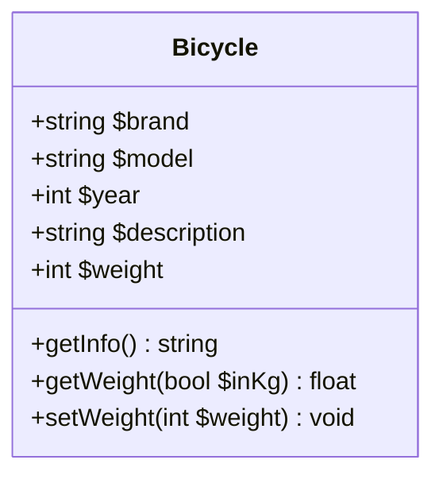
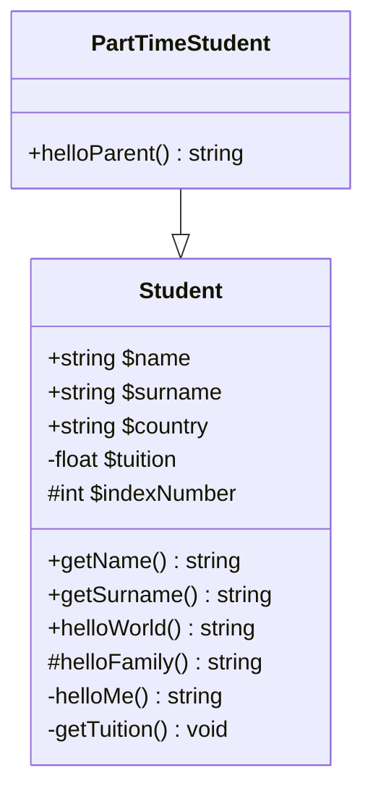
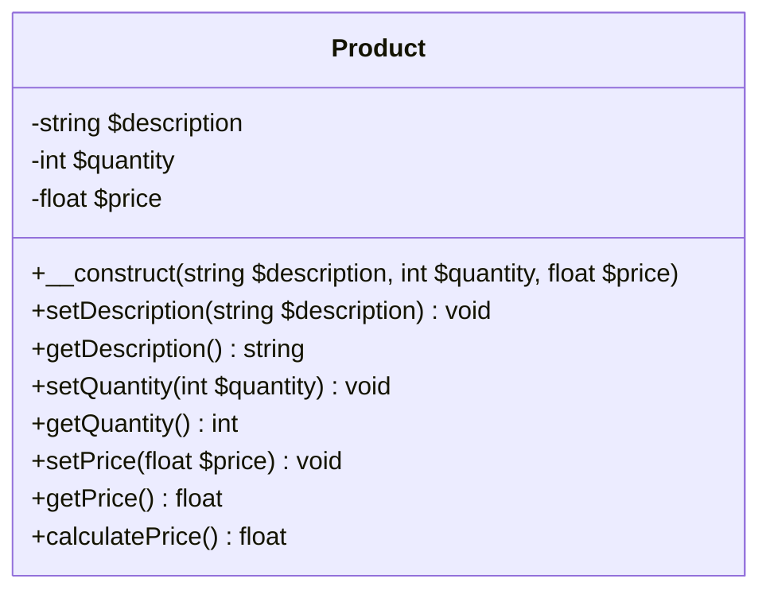
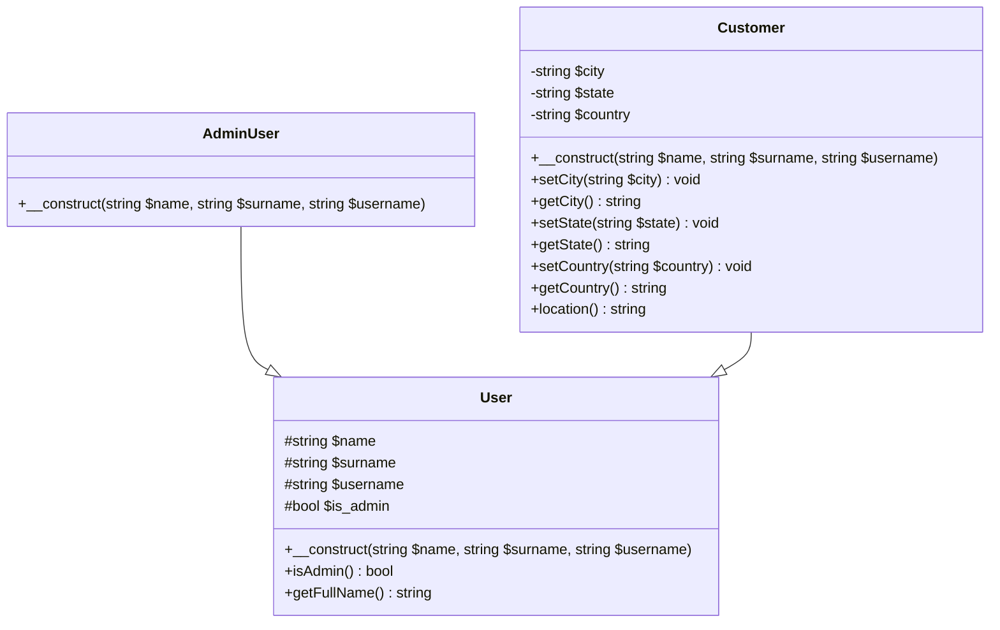

# PHP POO – Exercices

## Exercice 1

Créez une classe appelée **Bicycle**.

La classe doit avoir 5 propriétés publiques :
- `$brand`, `$model`, `$year`, `$description` et `$weight`.
La valeur par défaut de la propriété `$description` est « Vélo d’occasion » (indice : vous pouvez la définir soit lors de la déclaration de la propriété, soit via le constructeur).

Créez une méthode **getInfo** (un getter) qui retournera les informations sur le vélo au format suivant :
« `$brand $model ($year)` ».

Créez une méthode **getWeight** qui retournera le poids en grammes. Rendez cette méthode configurable pour qu’elle accepte un argument, par défaut à `false`. Si cet argument est `true`, le poids doit être retourné en kilogrammes ; s’il est `false` (par défaut), le poids doit être retourné en grammes.

Créez une méthode setter pour la propriété `$weight`. La propriété `$weight` stocke le poids en grammes.

Créez deux objets de la classe **Bicycle** et définissez les valeurs pour toutes les propriétés.
Affichez les informations de chaque vélo.
Affichez le poids de chaque vélo en kilogrammes.
Affichez le poids de chaque vélo en grammes.



## Exercice 2

Créez une classe appelée Student.

La classe doit avoir :
- 3 propriétés publiques : $name, $surname et $country ;
- 1 propriété privée : $tuition ;
- 1 propriété protégée : $indexNumber.

Créez des méthodes getter pour le nom et le prénom de l’étudiant.

Créez une méthode publique helloWorld() qui retournera la chaîne « Hello World ».
Créez une méthode protégée helloFamily() qui retournera la chaîne « Hello Family ».
Créez une méthode privée helloMe() qui retournera la chaîne « Hello me! ».
Créez une méthode privée getter getTuition() qui affichera la valeur de la propriété $tuition.

Ne pas utiliser de constructeur avec arguments.

Créez une classe fille `PartTimeStudent`.

Ajoutez une méthode publique helloParent() qui appellera la méthode helloFamily() de la classe Student.

Créez des objets des classes Student et `PartTimeStudent`, et appelez toutes les méthodes disponibles.



## Exercice 3

Créez une classe appelée Product.

La classe doit avoir 3 propriétés : $description, $quantity et $price.
Créez une méthode constructeur acceptant 3 arguments ($description, $quantity et $price). Dans le constructeur, vérifiez que la description est une chaîne de caractères et que la quantité et le prix sont des nombres. Si ce n’est pas le cas, affichez un message d’erreur.
Créez des méthodes setter et getter pour les propriétés $description, $quantity et $price.
Créez une méthode appelée calculatePrice() qui retournera le prix du produit sous la forme : $quantity * $price.
Créez un objet de la classe Product. Affichez toutes les propriétés sur des lignes distinctes, puis affichez le résultat de la méthode calculatePrice().



## Exerice 4

Créez une interface `HasInfo` qui aura une méthode abstraite appelée getInfo().

Créez une classe appelée `Address` qui implémente l’interface HasInfo.

La classe doit avoir 3 propriétés publiques : street, number et city. Définissez-les via le constructeur.

La méthode getInfo() dans cette classe doit retourner : « Address: street $street, number $number, city $city ».

Créez une classe appelée Phone qui implémente l’interface HasInfo.

La classe doit avoir 2 propriétés publiques : prefix et number. Définissez-les via le constructeur.
La méthode getInfo() dans cette classe doit retourner : « Number: $prefix / $number ».
Créez une classe appelée User qui implémente l’interface HasInfo.
La classe doit avoir 2 propriétés publiques : name et surname.
La classe doit avoir 2 propriétés privées : address et phone (instances des classes ci-dessus).

La méthode getInfo() dans cette classe doit appeler les méthodes getInfo() des classes Address et Phone respectivement.

Cette méthode doit renvoyer une chaîne de caractères similaire à cete exemple :
```text
User: Ada Lovelace
Address: 13 rue Babbage
Number: $prefix / $number
```

Créez un objet de chaque classe.

Appelez la méthode getInfo de l’objet User pour voir le résultat ci-dessus.

```mermaid
classDiagram
    interface HasInfo {
        <<interface>>
        +getInfo() string
    }

    class Address {
        +string street
        +int number
        +string city
        +getInfo() string
    }

    class Phone {
        +string prefix
        +string number
        +getInfo() string
    }

    class User {
        +string name
        +string surname
        -Address address
        -Phone phone
        +getInfo() string
    }

    Address ..|> HasInfo
    Phone ..|> HasInfo
    User ..|> HasInfo
```

## Exercice 5

Créez 3 classes : User, AdminUser et Customer.

Classe User :
- Doit avoir 3 propriétés protégées : $name, $surname et $username ;
- Définissez leurs valeurs via une méthode constructeur ;
- Ajoutez 1 propriété protégée $is_admin. Sa valeur par défaut doit être false ;
- Créez une méthode qui vérifie si l’utilisateur est admin ;
- Créez une méthode qui affiche le nom complet de l’utilisateur. Si l’utilisateur est admin, ajoutez (admin) à la fin.

Classe Customer: 
- Doit hériter de la classe User :
- Ajoutez 3 propriétés privées : $city, $state, $country ;
- Le constructeur de la classe Customer doit avoir les mêmes paramètres que le constructeur parent ;
- Pour les autres propriétés, créez des méthodes setter et getter ;
- Créez une méthode location() qui retourne « $city, $state, $country ».

Classe AdminUser :
- Doit étendre la classe User ;
- Le constructeur doit avoir les mêmes paramètres que le constructeur parent ;
- Le constructeur doit définir la valeur de la propriété $is_admin à true.
- Créez des objets de chaque classe. Affichez le nom complet et la valeur de $is_admin pour chaque objet, et en plus la localisation (ville, état, pays) pour les objets Customer uniquement

